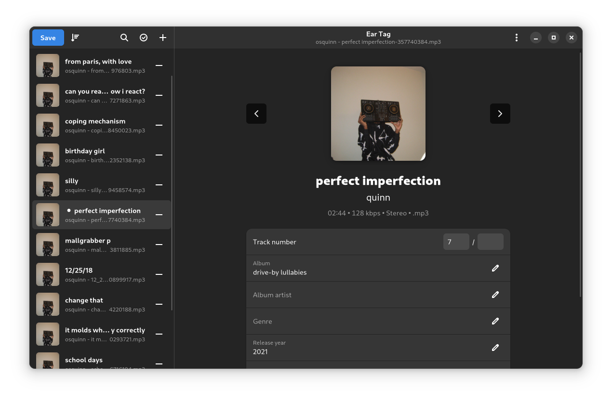

# Ear Tag

Small and simple audio file tag editor



## About

Ear Tag is a simple audio file tag editor. It is primarily geared towards making quick edits or bulk-editing tracks in albums/EPs. Unlike other tagging programs, Ear Tag does not require the user to set up a music library folder.

Ear Tag supports both desktop and mobile form factors.

## Installing

Ear Tag is available on [Flathub](https://flathub.org/apps/details/app.drey.EarTag), as well as the following software repositories:

[](https://repology.org/project/eartag/versions)

## Dependencies

Ear Tag is written in Python, and uses GTK4 and libadwaita for the UI. The following dependencies are required:

- Python >= 3.8
- GTK4 >= 4.12.0
- libadwaita >= 1.4.0
- pygobject
- pillow (used for some picture operations)
- mutagen (used for file tagging)
- python-magic (used for MIME type detection)
- pyacoustid (used for Identify Selected Files option)

## Building

We use the meson build system. The build process is as follows:

```
meson output
meson compile -C output
meson install -C output
```

For development purposes, this is automated in the provided `run` script.

## Contributing

Project development happens on [GNOME's GitLab instance](https://gitlab.gnome.org/World/eartag). For starters, check out the [open issues](https://gitlab.gnome.org/World/eartag/-/issues).

You are expected to follow the [GNOME Code of Conduct](https://wiki.gnome.org/Foundation/CodeOfConduct) when participating in project spaces.

### Commit style

**Please follow the following commit style:**

 - All commits have a prefix that contains the area of the code that has been changed:
   - For the README.md file, build files (meson.build) and things like .gitignore, this is `meta:`
   - For anything in the data directory, this is `data:`
   - For anything related to translations or the po directory, this is `po:`
   - For the actual code, this is the filename of the main file you've edited, e.g. `fileview:`
 - Commit messages are in all lowercase, except for class names, filenames (if they're capitalized - like README, COPYING etc.) and project names (e.g. Musicbrainz).

## TODO

While Ear Tag is ready to use as-is, there are a few nice features that may be added in the near future. You can find them in our [bug tracker](https://gitlab.gnome.org/World/eartag/-/issues/?label_name%5B%5D=feature%20request).

The project's fully open-source, so if you feel like you could try to implement one of these features, feel free to do so and send a patch to us!
